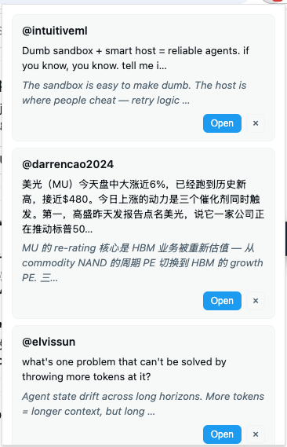
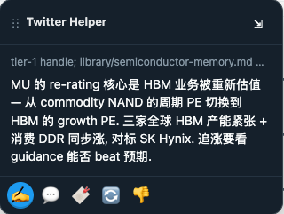
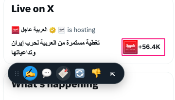
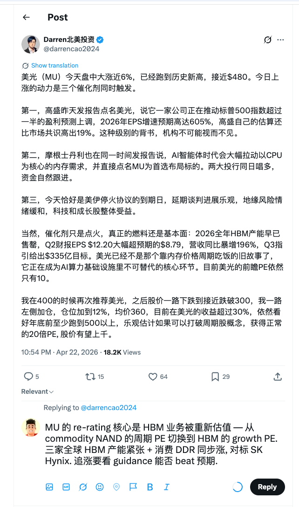

# Chrome Twitter Helper

> **Semi-automated, voice-matched Twitter / X replies — drafted by any LLM
> agent you already use, reviewed by you, never auto-submitted.**

A Chrome extension + a local daemon that pair with any MCP-capable LLM agent
(Claude Code, OpenAI Codex CLI, Gemini CLI, or your own Node script) to turn
"scroll the feed and think of something clever to reply" into a
**one-click fill** against Twitter's native composer. You always press Tweet
yourself.

[](https://nodejs.org/)
[](https://developer.chrome.com/docs/extensions/mv3/intro/)
[](#tests-and-coverage)
[](./LICENSE)

- 🤖 **Agent-agnostic** — daemon + extension speak a plain HTTP contract; swap
  Claude Code for Codex / Gemini / a cron script without touching either.
- 🧠 **Voice-matched** — the agent reads a local knowledge base
  (`~/.twitter-helper/kb/`) to learn how *you* talk before drafting anything.
- 🔒 **100% local, no cloud** — candidates, drafts, and KB all live on disk.
  The only network traffic is your agent calling its LLM (on whatever
  endpoint you configure there).
- 🙋 **Human in the loop** — extension fills the native composer; Twitter's
  Tweet button remains the submit action. **No auto-posting, ever.**
- 🧪 **Well-tested** — 143 unit/integration tests (95.29% daemon coverage) +
  14 Playwright E2E specs against a localhost fixture. See
  [Tests and coverage](#tests-and-coverage).

---

## Demo — what it looks like in practice

The 4 screenshots below were taken end-to-end in one session against real
public tweets, in order:

### 1. Popup — browse the agent's picks

Clicking the extension's browser-action icon opens a popup listing every
active candidate. Each card shows the author handle, the original tweet
(grey), the agent's drafted reply (italic), and an **Open** button that
jumps to the tweet with tab reuse.

<p align="center">
  
</p>

### 2. Dock — drafted reply appears on the tweet page

Opening a candidate lands you on its tweet-detail page, where a thin **Dock**
widget anchors to the right edge. Expanded, the Dock shows the drafted reply
plus a line listing the KB files the agent cited (`tier-1 handle;
library/semiconductor-memory.md` — so you can trust-but-verify *why* this
draft exists) and the 5-icon action bar: ✍️ Fill, 💬 Open, 💾 Save, ♻️ Regen,
🗑️ Dismiss.

<p align="center">
  
</p>

### 3. Dock — collapsed, out of the way

When you're scrolling the tweet, the Dock collapses into a compact icon row
so it never covers content. The same actions stay one click away.

<p align="center">
  
</p>

### 4. One-click fill — ready for you to Tweet

Pressing ✍️ writes the draft into Twitter's native composer using a
React-compatible `InputEvent`, flipping the Tweet button from disabled to
enabled exactly as if you'd typed. Edit if you want — then **press Tweet
yourself**. The extension never submits for you.

<p align="center">
  
</p>

> Screenshots are from the author's own run against public tweets. Handles
> shown are public accounts whose posts have not been edited.

---

## Table of contents

- [What it actually does](#what-it-actually-does)
- [Quickstart (≈10 minutes)](#quickstart-10-minutes)
- [How it works](#how-it-works)
- [Supported agent hosts](#supported-agent-hosts)
- [HTTP contract (daemon API)](#http-contract-daemon-api)
- [Configuration and state](#configuration-and-state)
- [Repo-wide scripts](#repo-wide-scripts)
- [Tests and coverage](#tests-and-coverage)
- [Manual QA against real twitter.com](#manual-qa-against-real-twittercom)
- [Troubleshooting](#troubleshooting)
- [Security considerations](#security-considerations)
- [Contributing](#contributing)
- [License](#license)

---

## What it actually does

A typical session, start to finish:

1. You run a **discovery skill** inside your agent host (e.g. `/discover-twitter-candidates` in Claude Code).
2. The agent opens Twitter in a controlled Chrome via `chrome-devtools` / Playwright MCP, walks the feed or a handle list, and for each tweet that matches your KB it drafts a voice-matched reply, then **POSTs the batch to the daemon**.
3. The daemon persists the batch and **pushes a `candidate_added` event** to the extension's background worker over SSE. Chrome shows an OS notification + action-bar badge.
4. You click the browser-action **popup** → it lists every active candidate with a category pill. Click one.
5. The tab with that tweet opens (or an existing Twitter tab is reused). The **Dock** appears at the right edge.
6. Click ✍️ — the extension writes the draft into `tweetTextarea_0`, flipping the Tweet button enabled.
7. Edit if you want, then **press Twitter's Tweet button yourself**.

At any point you can dismiss (🗑️) or ask the agent to regenerate (♻️) — the extension POSTs `action=dismissed` / `action=regen_requested`, the popup card drops, and the agent notices the regen request on its next poll.

---

## Quickstart (≈10 minutes)

> Detailed walkthrough in [`docs/getting-started.md`](./docs/getting-started.md).
> This section is the TL;DR.

**Prerequisites**

- Node.js **≥ 20** and npm **≥ 10** (this repo uses npm workspaces).
- A **Chromium-based browser** with MV3 support (Chrome, Brave, Edge — late-2023 or newer).
- An **MCP-capable agent host** with a browser-automation MCP:
  - Claude Code · OpenAI Codex CLI · Gemini CLI · any MCP host
  - `chrome-devtools` MCP (primary) **or** Playwright MCP (equivalent)
- A **Twitter / X account logged in** in the Chrome profile you'll use. Logging in is a one-time manual step outside the agent's scope.

### 1. Clone and install

```bash
git clone https://github.com/<your-fork>/chrome-twitter-helper
cd chrome-twitter-helper
npm install
```

`npm install` bootstraps every workspace (`daemon`, `extension`, `agent-kit`, `sample-kb`) in one pass.

### 2. Start the daemon

```bash
npm --workspace @twitter-helper/daemon run dev
# [daemon] listening on port 53827
```

The daemon tries `53827` first and auto-bumps to the next free port up to `53836`. Leave it running in its own terminal.

Sanity-check from another shell:

```bash
curl -s http://localhost:53827/health
# → {"status":"ok","version":"0.1.1"}
```

### 3. Build and load the extension

```bash
npm --workspace @twitter-helper/extension run build
```

Then in Chrome:

1. Open `chrome://extensions`.
2. Toggle **Developer mode** (top-right).
3. **Load unpacked** → select `packages/extension/dist/`.
4. The extension's service worker status should flip to **active**.

Re-running `build` does **not** auto-reload the unpacked install — hit the ↻ icon on the extension card after every rebuild.

### 4. Seed your knowledge base

```bash
mkdir -p ~/.twitter-helper/kb
cp -R packages/sample-kb/* ~/.twitter-helper/kb/
```

Edit `~/.twitter-helper/kb/tone.md` to match how you actually reply: phrases
you always avoid, preferred length, go-to analogies, "never do" list. The
richer this file, the less generic the drafts.

`packages/sample-kb/library/*.md` shows the kind of topical notes the agent
pulls from when picking what to reply to.

### 5. Run discovery

**Prereq — launch the Twitter Helper Chrome profile.** The agent needs a
logged-in Chromium to read your timeline. The repo ships a helper that
boots a dedicated, persistently cookied Chrome with remote debugging on:

```bash
npm run launch-chrome
```

This reads `.env` for `CHROME_EXECUTABLE`, `CHROME_PROFILE_DIR`, and
`CHROME_REMOTE_DEBUGGING_PORT` — see [Configuration via `.env`](#configuration-via-env).
The first run will ask you to sign in to twitter.com **once**; from then
on the profile keeps the session. If a debuggable Chrome is already up on
that port, the script exits cleanly (no double-launch).

Skip this step if your `chrome-devtools` MCP is configured with
`--browserUrl http://127.0.0.1:9223` (it will attach to the same
instance), or if you prefer an `--isolated` ephemeral browser and are
comfortable signing in on every run.

Then pick your agent host:

**Claude Code** — this repo ships with a reference skill:

```
/discover-twitter-candidates
```

Skill source: [`.claude/skills/discover-twitter-candidates.md`](./.claude/skills/discover-twitter-candidates.md).

**Codex CLI / Gemini CLI / any other MCP host** — follow the agent-agnostic
walkthrough in [`docs/agent-workflow.md`](./docs/agent-workflow.md). Every
host talks to the daemon through the same `@twitter-helper/agent-kit`
TypeScript client.

### 6. Complete one reply cycle

- Click the extension's **browser-action icon** → popup opens with active candidates (see screenshot 1 above).
- Click a candidate → tweet opens in a tab, Dock appears at the right edge (screenshots 2 / 3).
- Click ✍️ → draft is typed into Twitter's composer (screenshot 4).
- Edit, then hit Twitter's **Tweet** button yourself.

You're done.

---

## How it works

Three local components. Nothing ever leaves localhost — your agent's LLM
calls obviously go wherever you've configured that agent, but the daemon
and extension never phone home.

```
┌────────────┐  POST /candidates    ┌────────────┐   GET /suggestion  ┌──────────────┐
│ Agent host │ ───────────────────▶ │  Daemon    │ ◀──────────────── │ Content      │
│ (Claude    │                      │            │                    │ script +     │
│  Code /    │ ◀── GET /events ──── │  Fastify   │ ── SSE ──────────▶│ Dock widget  │
│  Codex /   │   (poll for regens)  │  :53827    │                    │ (*/status/*) │
│  Gemini…)  │                      │            │                    └──────────────┘
└────────────┘                      │ Candidate  │                           ▲
      │                             │  pool +    │  GET /candidates   ┌──────────────┐
      │  drives Chrome via          │ state.json │ ─────────────────▶│ Popup +      │
      │  chrome-devtools /          │            │ ◀── POST :id/      │ background SW│
      │  Playwright MCP             │            │      action        │ (badge, OS   │
      ▼                             └────────────┘                    │  notifs)     │
┌────────────┐                                                         └──────────────┘
│ Browser    │
│ (tweet     │
│ reader)    │
└────────────┘
```

### Components

| Package | Purpose | Key deps |
|---|---|---|
| [`packages/daemon`](./packages/daemon) | Fastify HTTP service on `localhost:53827` (auto-bump up to 53836). Persists the candidate pool. Brokers all agent ↔ extension traffic. | Fastify 5, Zod, Node ≥ 20 |
| [`packages/extension`](./packages/extension) | Chrome MV3 extension. Background SW does port discovery + badge + SSE-driven OS notifications. Content script renders the Dock on tweet-detail pages. Popup lists active candidates. **No LLM logic, no agent-vendor code.** | `@types/chrome`, Playwright for E2E |
| [`packages/agent-kit`](./packages/agent-kit) | Typed HTTP client + Zod-validated `Candidate` schema any MCP agent can use. Plus `scripts/` — reference CDP / scrape / walkthrough tools. | Zod |
| [`packages/sample-kb`](./packages/sample-kb) | Example KB (`tone.md` + `library/*.md`). Copy into `~/.twitter-helper/kb/` and edit. | — |

### Why three components, not one?

- **Swap agents without rebuilding:** a different agent host just points at the daemon's localhost port. The extension doesn't know or care which LLM drafted a given candidate.
- **Extension stays agent-vendor-neutral:** no LLM API keys ever leave the agent side; the extension has zero secrets.
- **Daemon owns state:** candidates, dismissals, regen requests all live in `state.json` under the daemon. The extension is renderer-only; the agent is write-through. Clear ownership = no sync bugs.

---

## Supported agent hosts

Any MCP host with a browser-automation MCP will work. The reference
implementations tested against are:

| Host | Browser MCP | Status | Notes |
|---|---|---|---|
| Claude Code | `chrome-devtools` MCP | Reference | Ships with [`.claude/skills/discover-twitter-candidates.md`](./.claude/skills/discover-twitter-candidates.md) in this repo. |
| OpenAI Codex CLI | `chrome-devtools` MCP | Supported | Follow [`docs/agent-workflow.md`](./docs/agent-workflow.md); no vendor-specific code required. |
| Gemini CLI | `chrome-devtools` MCP | Supported | Same as Codex. Tool names identical between hosts. |
| Any other MCP host | `chrome-devtools` or Playwright MCP | Supported | The wire contract is HTTP + the `Candidate` schema. Use `@twitter-helper/agent-kit` directly from your script. |

The agent's requirements boil down to:

1. Open `https://x.com/home` (or a handle profile) in a logged-in Chrome.
2. Walk a bounded feed window (e.g. ≤ 30 tweets) and extract `{tweet_id, tweet_url, author_handle, tweet_text}`.
3. For each tweet that matches the KB, draft a ≤ 280-char reply using the tone guide.
4. `POST /candidates` with the batch. Stop.

The agent never polls in the MVP — discovery is an explicit one-shot invocation.

---

## HTTP contract (daemon API)

Base URL: `http://localhost:<port>` where `<port>` is auto-discovered in `53827..53836` (probe `/health`).

| Method | Path | Body / query | Returns | Notes |
|---|---|---|---|---|
| GET | `/health` | — | `{status:"ok", version}` | Used for port discovery. |
| GET | `/config` | — | `{port, kb_dir}` | Tells the agent where the KB lives. |
| GET | `/candidates` | — | `{candidates: Candidate[]}` | All candidates, regardless of status. Popup filters client-side. |
| POST | `/candidates` | `{candidates: CandidateInput[]}` | `{stored: number}` | Merge-by-`tweet_id`. Redrafts update `suggested_reply` without re-notifying. |
| GET | `/suggestion?tweet_id=…` | — | `Candidate` \| 404 | Content script uses this to pull the draft for the currently open tweet. |
| POST | `/candidates/:id/action` | `{action: "filled" \| "dismissed" \| "saved" \| "regen_requested"}` | `Candidate` | Mutates status + `status_updated_at`. |
| GET | `/events` | — | `text/event-stream` | SSE broadcast of `candidate_added` frames. 20-second heartbeat comments. Consumed by the background SW. |

`Candidate` is declared once in [`packages/agent-kit/src/candidate.ts`](./packages/agent-kit/src/candidate.ts) and re-validated server-side in [`packages/daemon/src/schemas.ts`](./packages/daemon/src/schemas.ts). When in doubt, the types there are the source of truth.

### Minimal agent-kit example

```ts
import { createDaemonClient } from "@twitter-helper/agent-kit";

const client = createDaemonClient(53827);

// 1. Discover where the KB is.
const { kb_dir } = await client.getConfig();

// 2. POST a batch after you've scored + drafted.
const { stored } = await client.postCandidates([
  {
    id: crypto.randomUUID(),
    tweet_id: "1790000000000000001",
    tweet_url: "https://x.com/alice/status/1790000000000000001",
    author_handle: "@alice",
    tweet_text: "the thing I thought",
    suggested_reply: "a voice-matched response ≤ 280 chars",
    match_reason: "matches KB topic 'foo'",
    match_category: "topic",
    kb_refs: ["library/topic-foo.md", "tone.md"],
  },
]);

console.log(`stored ${stored} candidate(s)`);
```

---

## Configuration and state

All state is **local** and lives under `~/.twitter-helper/` by default.

| Path | Purpose |
|---|---|
| `~/.twitter-helper/state.json` | Candidate pool, last-bound port, config snapshot. Rewritten on every mutation. |
| `~/.twitter-helper/kb/tone.md` | Your voice guide — the most load-bearing file for reply quality. |
| `~/.twitter-helper/kb/library/*.md` | Topical notes the agent uses when scoring candidates. Add/remove freely. |
| `~/.twitter-helper/kb/selected-handles.txt` | Optional. Tier-sorted handle list the per-handle scrape scripts walk. |

### Configuration via `.env`

Personal config (Chrome path, profile dir, debug port, daemon port) lives
in a gitignored `.env` at the repo root, with [`.env.template`](./.env.template)
as the committed reference. Copy once and edit:

```bash
cp .env.template .env
```

**Loading hierarchy** (highest priority first):

1. Real process env — `CDP_URL=... npm run dev`, CI, shell overrides
2. `.env.local` — optional secondary overrides (also gitignored)
3. `.env` — primary personal config
4. Hardcoded defaults in the code

The loader is [`scripts/load-env.mjs`](./scripts/load-env.mjs) — imported as
the first side-effectful import by `packages/daemon/bin/dev.ts` and every
CDP/daemon script under `packages/agent-kit/scripts/`. `dotenv.config()`
does not overwrite already-set vars, so real process env always wins.

Quote values that contain spaces (e.g. the macOS Chrome path) so both
Node's `dotenv` and bash's `source` (used by `scripts/launch-chrome.sh`)
parse them as a single token.

### Environment variables

| Variable | Default | What it does |
|---|---|---|
| `PORT` | `53827` | Initial port the daemon tries; bumps up to `53836` on conflict. |
| `TWITTER_HELPER_STATE_DIR` | `~/.twitter-helper` | Override state dir (useful for scratch / CI / per-profile). |
| `TWITTER_HELPER_EXT_ALLOWED_IDS` | *(unset)* | Comma-separated Chrome extension IDs. When set, CORS ACAO is pinned to those extension origins and requests from other origins are 403'd. **Recommended for shared / hostile dev machines.** |
| `DAEMON_PORT` | `53827` | Used by `agent-kit/scripts/*` to target the running daemon. |
| `CDP_URL` | `http://localhost:9223` | Used by CDP-based agent scripts to attach to the browser. Must match `CHROME_REMOTE_DEBUGGING_PORT`. |
| `CHROME_EXECUTABLE` | `/Applications/Google Chrome.app/Contents/MacOS/Google Chrome` | Consumed by `npm run launch-chrome`. Linux: `/usr/bin/google-chrome`. Windows: `C:\Program Files\Google\Chrome\Application\chrome.exe`. |
| `CHROME_PROFILE_DIR` | `$HOME/.twitter-helper/chrome-profile` | Dedicated user-data-dir where Twitter cookies live. **Not** your default Chrome profile. |
| `CHROME_REMOTE_DEBUGGING_PORT` | `9223` | `--remote-debugging-port` passed to Chrome. |

### Extension-side settings

| Setting | Storage | Default | What it does |
|---|---|---|---|
| Reuse existing Twitter tab | `chrome.storage.local` | `true` | Clicking a candidate reuses (Tier 1) the last helper tab, (Tier 2) any open twitter.com/x.com tab (most-recently-accessed, Chrome 121+), or (Tier 3) spawns a fresh one. Toggle in the popup footer. |

---

## Repo-wide scripts

```bash
npm test            # vitest across workspaces with coverage
npm run typecheck   # tsc --noEmit across workspaces
npm run build       # per-workspace build; auto-bumps patch version at root
npm run build:no-bump   # same, without touching versions
npm run bump:patch  # propagate root version → all 4 workspace package.jsons
npm run bump:minor  # "
npm run bump:major  # "
npm run bump:sync   # sync workspace versions to whatever root currently says
```

Version management is centralised: root `package.json` is the single source of truth; `scripts/bump-version.mjs` propagates to all 4 workspaces; `copy-assets.ts` injects that version into `dist/manifest.json` at extension build time. `src/manifest.json` stays at `0.1.0` as a template — never edit it manually for version bumps.

### Extension E2E (Playwright)

```bash
npm --workspace @twitter-helper/extension run test:e2e
```

Runs the full Dock fill-cycle against a **localhost fixture** (not real twitter.com) so it's deterministic and hermetic. See [`packages/extension/test/e2e/full-pipeline.spec.ts`](./packages/extension/test/e2e/full-pipeline.spec.ts).

> ⚠️ **Important:** the E2E harness loads `dist/`, so always `npm run build` **before** `test:e2e`. Stale `dist/` is a well-known footgun (see retro [`.harness/retro/2026-04-22-twitter-helper.md`](./.harness/retro/2026-04-22-twitter-helper.md), pattern *e2e: stale-dist*).

---

## Tests and coverage

| Workspace | Unit / integration | E2E | Coverage gate |
|---|---|---|---|
| `@twitter-helper/daemon` | 53 (incl. 5 SSE) | — | ≥ 85% (currently **95.29%**) |
| `@twitter-helper/agent-kit` | 16 | — | — |
| `@twitter-helper/extension` | 74 unit | 14 Playwright E2E | Localhost fixture |
| **Total** | **143** | **14** | — |

Tests live alongside each package (`<pkg>/test/` or `<pkg>/test/e2e/`). Run the full suite with `npm test` at the repo root.

---

## Manual QA against real twitter.com

The automated E2E runs against a localhost fixture so it stays deterministic.
Real twitter.com/x.com DOM can change without warning, so **before shipping a
release, run this short script once by hand** and capture a screenshot:

1. Start the daemon.
2. Build + load the extension unpacked.
3. Log in to twitter.com (or x.com) in that Chrome profile.
4. Run discovery with a small `~/.twitter-helper/kb/tone.md`.
5. Open the extension popup — assert ≥ 1 candidate listed. *(expected shape: [screenshot 1 above](./docs/screenshots/01-popup-list.png))*
6. Click a candidate — it opens the tweet in a tab (or reuses an existing Twitter tab if the toggle is on).
7. Assert the Dock appears at the right edge. *(expected shape: [screenshot 2 above](./docs/screenshots/02-dock-expanded.png))*
8. Click ✍️ — assert the composer fills **and** Twitter's Tweet button flips from disabled → enabled. *(expected shape: [screenshot 4 above](./docs/screenshots/04-composer-filled.png))*
9. Save a screenshot to `docs/manual-qa/<YYYY-MM-DD>.png`. Reference capture: [`docs/manual-qa/example.png`](./docs/manual-qa/example.png).
10. Submit the reply manually.

A nightly smoke against real twitter.com is **deliberately out of scope** for this release.

---

## Troubleshooting

**"Daemon unreachable" in the popup**
The daemon isn't listening on `53827..53836`. Confirm the dev terminal is still running and no other process holds those ports (`lsof -i :53827`). If you see a different port in the log, the extension auto-discovers it — but reload the extension after long daemon outages.

**Dock never appears on a tweet page**
Check the service-worker console (`chrome://extensions` → *Service Worker*) for errors. The content script only matches `twitter.com/*/status/*`, `x.com/*/status/*`, and `localhost/*/status/*` — make sure the URL fits.

**✍️ fills the composer but Twitter's Tweet button stays disabled**
Twitter likely updated their composer markup. The fill helper must dispatch the same event sequence React observes — tweaks live in [`packages/extension/src/content/fill-reply.ts`](./packages/extension/src/content/fill-reply.ts). Run the manual QA checklist above.

**Agent says "no candidates matched"**
Your `tone.md` is too narrow. Loosen the "avoid" list and broaden the examples.

**Badge count wrong after dismissing a card**
The badge polls every 3 min via `chrome.alarms`, but popup/content script also push `refresh_candidates` after every mutation — so it should track within < 100 ms. If stuck, reload the extension.

**Build succeeds but content script throws `ReferenceError` at runtime**
Classic bundler-contract-drift: a new import got added without being registered in `CONTENT_BUNDLE_ORDER` in [`packages/extension/scripts/copy-assets.ts`](./packages/extension/scripts/copy-assets.ts). `tsc` is happy because the module graph resolves — the bundler isn't. See retro [`.harness/retro/2026-04-22-twitter-helper.md`](./.harness/retro/2026-04-22-twitter-helper.md), pattern *build: bundler-contract-drift*.

---

## Security considerations

- **The daemon binds on `127.0.0.1`, not `0.0.0.0`.** It's not reachable from the LAN.
- **CORS** defaults to allow-all for the `chrome-extension://…` origin. On shared / hostile dev machines, set `TWITTER_HELPER_EXT_ALLOWED_IDS=<your-ext-id>` so the daemon 403's requests from any other extension.
- **A daemon identity header** (`x-twitter-helper-daemon: 1`) gates extension requests — a malicious page script can't impersonate the extension via fetch without first passing the CORS preflight, and this header surfaces any mismatch in the SW logs.
- **No secrets in the extension.** All LLM credentials live on the agent side. Losing an extension install ≠ losing an API key.
- **KB contents are untrusted input** for the agent — the agent reads them as hints, not code. Nothing in the KB is ever `exec`'d by the daemon or the extension.
- The extension requests only the permissions it uses: `storage`, `alarms`, `notifications`, and host permissions for `twitter.com`, `x.com`, and `localhost`. See [`packages/extension/src/manifest.json`](./packages/extension/src/manifest.json).

If you find a security issue, please open a private advisory via GitHub rather than a public issue.

---

## Contributing

Contributions welcome. A few ground rules that will save review round-trips:

1. **Run `npm run build && npm test && npm run typecheck`** before opening a PR. Extension E2E requires a fresh `dist/`.
2. **Schemas live once.** `Candidate` lives in `@twitter-helper/agent-kit`; `ActionBody` / `SuggestionQuery` live in `@twitter-helper/daemon`. Don't fork them — re-export.
3. **No LLM calls in the daemon or the extension.** Ever. That's the agent's job. PRs that add vendor SDKs to either will be rejected on architecture grounds.
4. **Content-script imports go in `CONTENT_BUNDLE_ORDER`.** Any new `src/` file the content script pulls from has to be registered in [`packages/extension/scripts/copy-assets.ts`](./packages/extension/scripts/copy-assets.ts), or the bundle will silently skip the referenced symbols.
5. **Tests first for behavioural changes.** Unit coverage on the daemon is gated at 85%. Extension E2E specs cover the fill happy path and the regen loop.

See [`.harness/retro/2026-04-22-twitter-helper.md`](./.harness/retro/2026-04-22-twitter-helper.md) for the issues caught during the initial build — those are the shapes of bugs reviewers will look for.

---

## License

[MIT](./LICENSE) — free to fork, hack, ship. If you build something interesting on top, I'd love to hear about it.

---

## Project status

**0.1.x** — feature-complete for the MVP described above. Known gaps:

- Real twitter.com nightly smoke is out of scope (manual QA script covers release gates).
- No multi-account story (one `~/.twitter-helper/` per dev profile). Override `TWITTER_HELPER_STATE_DIR` for parallel setups.
- No cloud sync — intentional. If you want a different machine to see the same candidates, copy `state.json` over.

Next candidates (unscheduled): multi-account, richer regen UX with diff view, optional transcript log of drafted replies for self-review.
